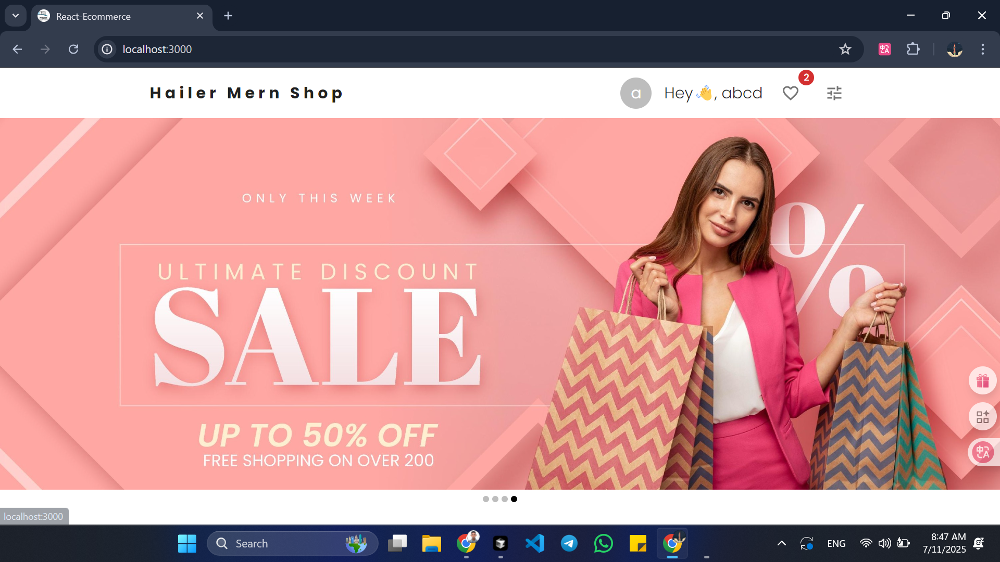
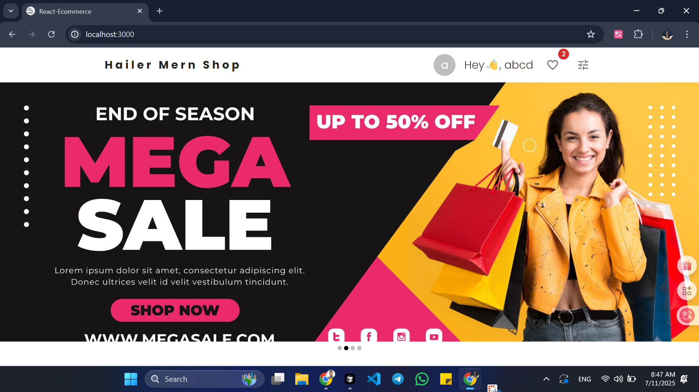
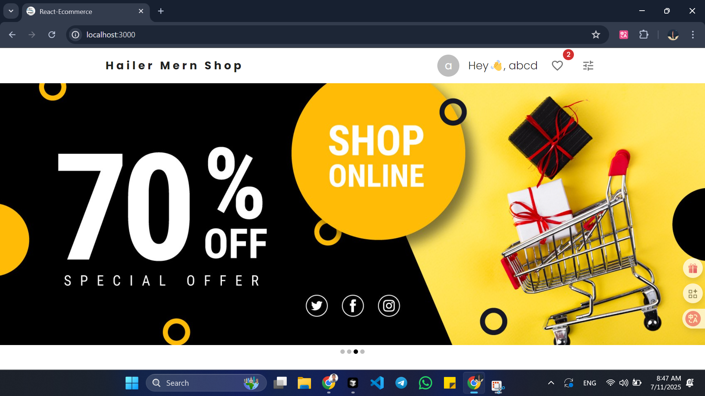
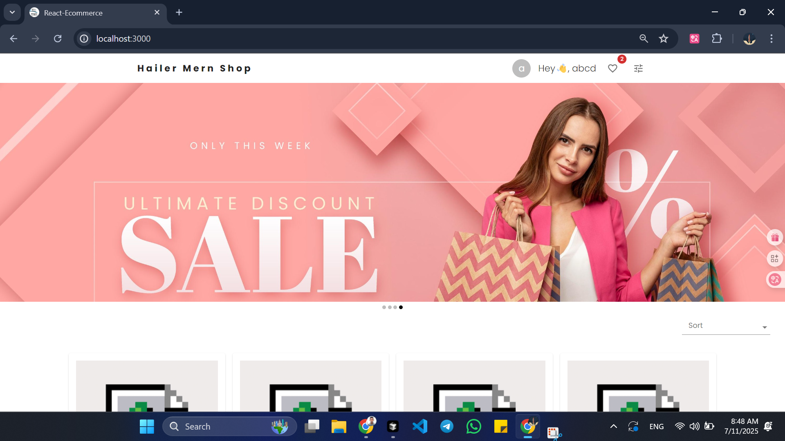
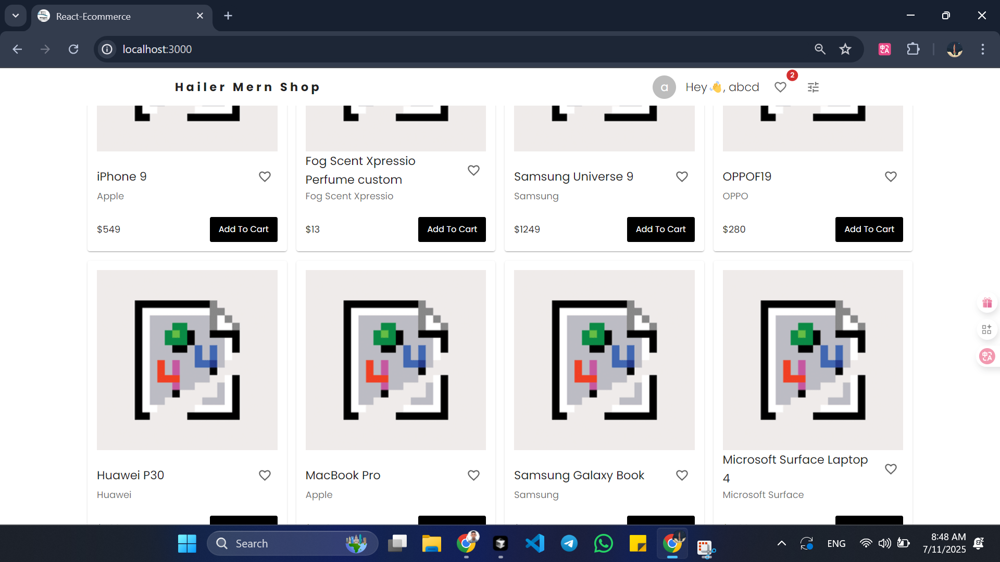
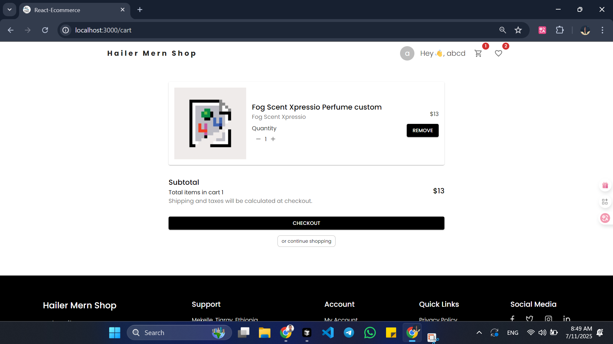
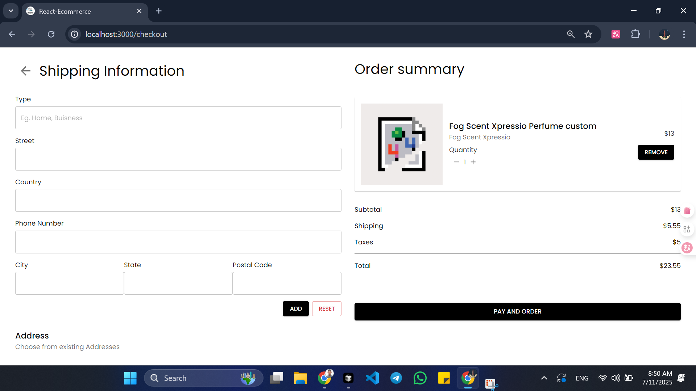

# MERN Commerce

A full-featured e-commerce web application built with the MERN stack (MongoDB, Express, React, Node.js).

## 🖼️ Screenshots

| Home Page                             | Product Page                          | Cart                                  | Checkout                                  |
| ------------------------------------- | ------------------------------------- | ------------------------------------- | ----------------------------------------- |
|  |  |  |      |
|  |  |  |  |

---

## 🎥 Demo

[](https://youtu.be/wRvTTlpbkqA?list=PLFsQbAK6u_Mdk1jGu7dN3RqPA_oq7AxoA)

_Click the image above to watch the full demo on YouTube!_

## Features

- User authentication & authorization
- Product catalog & search
- Shopping cart & checkout
- Order management
- Admin dashboard
- ...and more!

## Getting Started

### Clone the repository

```bash
git clone https://github.com/hailer-MIT/mern-ecommerce.git
```

### Install dependencies

```bash
cd mern-ecommerce
cd backend && npm install
cd ../frontend && npm install
```

### Set up environment variables

- Copy `.env.example` to `.env` in both backend and frontend folders and fill in your own values.

### Seed the database, locally

```bash
cd backend
node seed/index.js
```

### Run the app

- Backend: `npm start` (on port 5000)
- Frontend: `npm start` (on port 3000)

---

## Built by

[Hailom Asegede](https://github.com/hailer-MIT)

---

_This project is developed and maintained by Hailom Asegede. All rights reserved._
